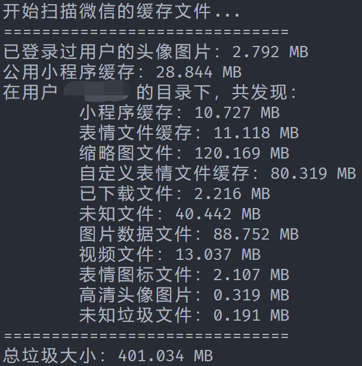

# Fuck-WeChat

Remove WeChat PC caches &amp; trash 清除微信PC版的所有缓存文件



**试着运行一下吧。在清理垃圾前会询问是否删除的。**

依赖项：
```
pathlib
shutil
progressbar2
```

现有问题：
1. 只能搜索微信PC版的默认缓存存放位置（`%HOME%\Documents\WeChat Files\`）
2. 只能删除全部缓存文件，不能保留部分文件
